# PlanPal
Sebuah aplikasi event planner untuk memudahkan mengelola acara

## Daftar Isi
- [Deskripsi Singkat](#deskripsi-singkat)
- [Cara Menjalankan Aplikasi](#cara-menjalankan-aplikasi)
- [Daftar Modul](#daftar-modul)
- [Daftar Tabel Basisdata](#daftar-tabel-basisdata)

## Deskripsi Singkat

Aplikasi ini dirancang untuk membantu mengelola acara secara teratur. Aplikasi ini berjalan secara lokal dan tidak membutuhkan koneksi internet. Fitur utama aplikasi mencakup melihat, mengelola, dan menghapus acara. Pengguna dapat melihat seluruh acara yang sudah dibuat dan melihat detil suatu acara yang mencakup nama acara, lokasi, tanggal, dan status acara. Pengguna juga dapat mengelola masing-masing acara dan dapat mengubah nama, lokasi, tanggal, status, anggaran, rundown, vendor, dan daftar tamu acara.

## Cara Menjalankan Aplikasi

### Prequisite
Pastikan anda memiliki python

```
https://www.python.org/downloads/
```

### Menjalankan Aplikasi
Install dependencies terlebih dahulu
```
pip install -r requirements.txt
```

Buka terminal dan ganti direktori ke:

```
...\IF2150-2024-K02-G08-PlanPal\src>
```

Jalankan program menggunakan python
```
python planpal.py
```

## Daftar Modul

### Modul Event
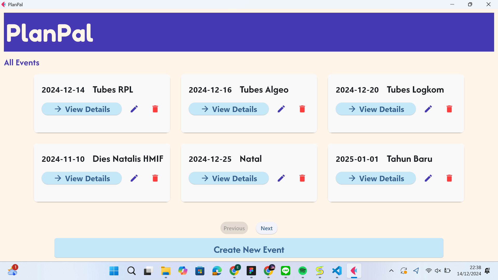  
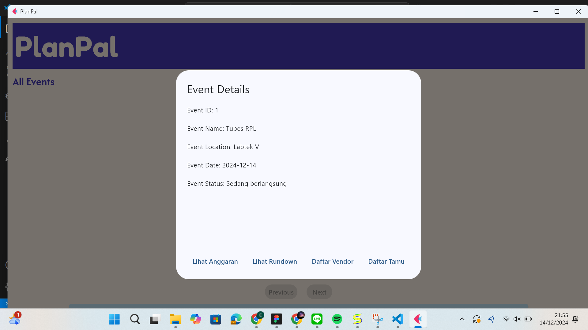  
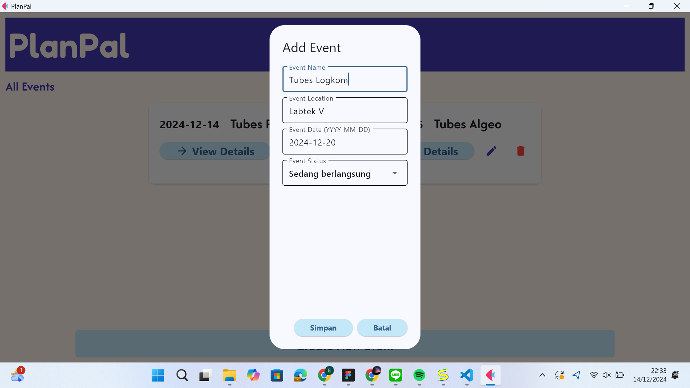  
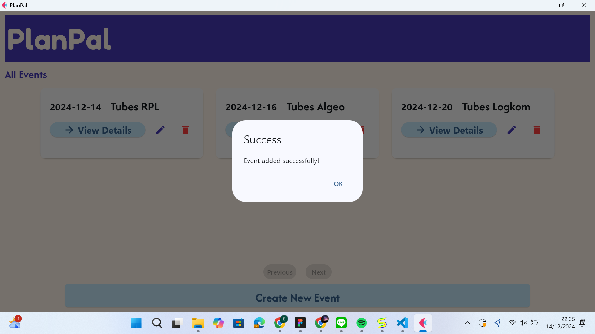  
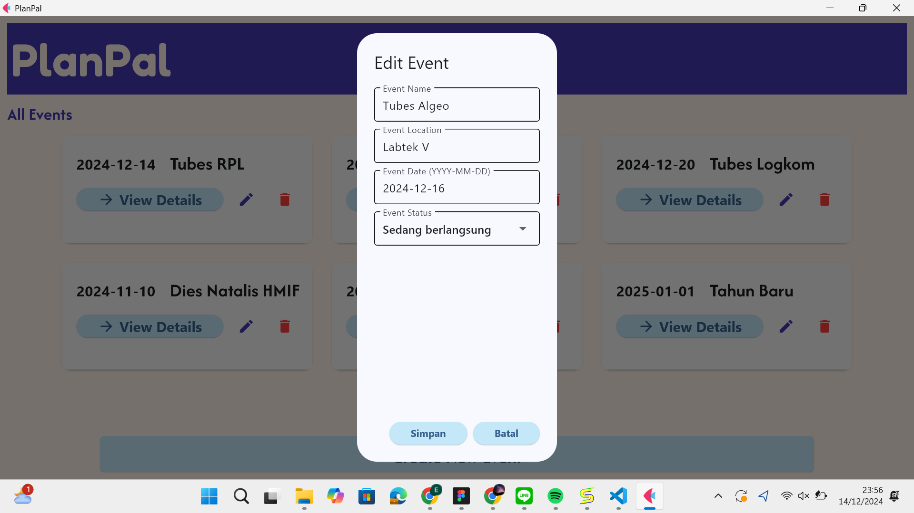  


### Modul Anggaran
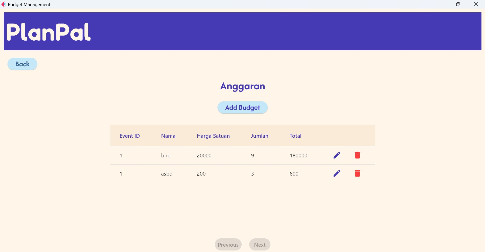  
  
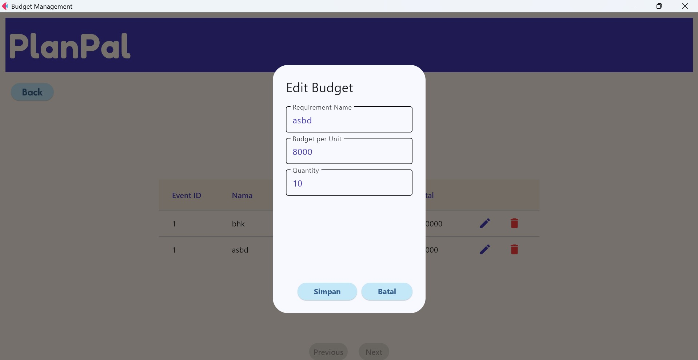  


### Modul Vendor
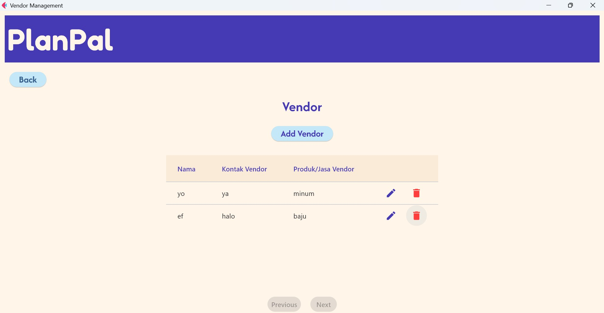  
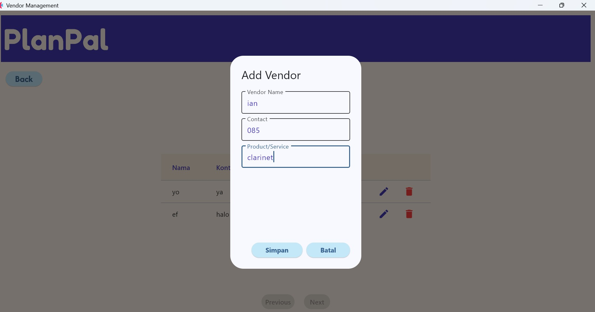  
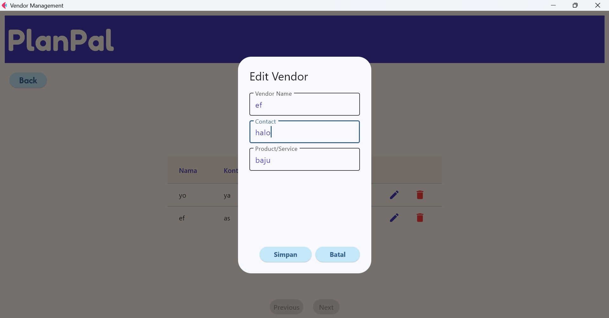  


### Modul Guest List


### Modul Rundown
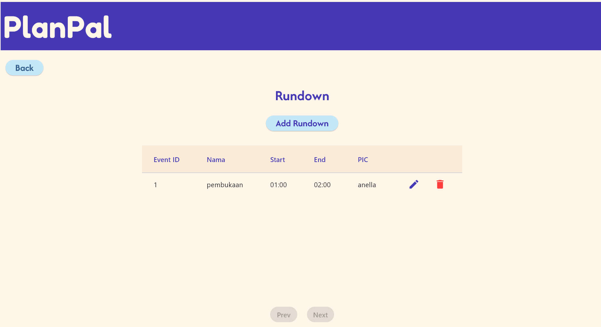  
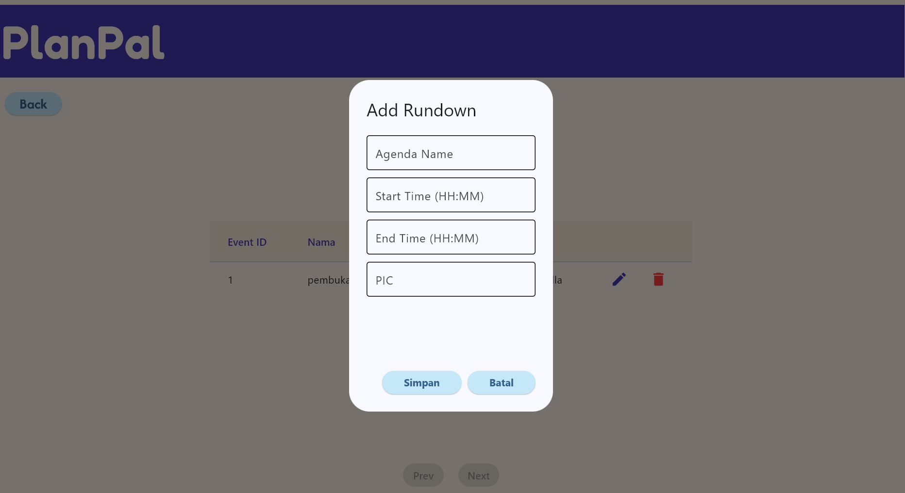  
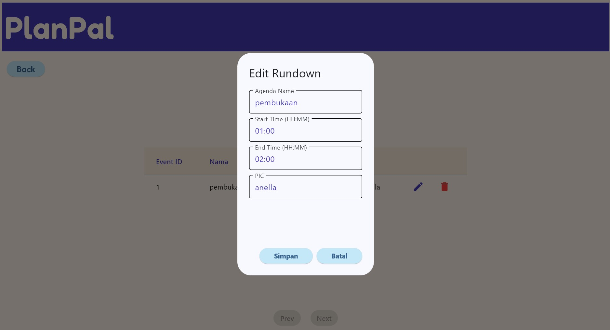  


### Pembagian Tugas

| No | Fitur   | NIM |
|----|---------|-----|
| 1  | Mengelola Suatu Acara | 13523070 |
| 2  | Melihat Daftar Acara  | 13523070, 13523060 |
| 3  | Filter Daftar     | 13523078 |
| 4  | Mengelola Anggaran    | 13523050 |
| 5  | Mengelola Vendor | 13523010, 13523050 |
| 6  | Mengelola  Daftar Tamu  | 13523078 |
| 7  | Mengelola Rundown | 13523060 |
| 8  | UI/UX | 13523050, 13523060 |
| 9  | Database | 13523010, 13523070 |
| 10 | Integrasi | 13523060, 13523070, 13523050, 13523078 |


## Daftar Tabel Basisdata

1. [Tabel dan Atribut](#tabel-dan-atribut)
    - [Tabel 1: Event](#tabel-1-event)
    - [Tabel 2: Guest List](#tabel-2-guest-list)
    - [Tabel 3: Budget](#tabel-3-budget)
    - [Tabel 4: Vendor](#tabel-4-vendor)
    - [Tabel 5: Rundown](#tabel-5-rundown)

## Tabel dan Atribut

### Tabel 1: Event


Tabel ini berisi data event

| Atribut       | Tipe Data | Keterangan |
|---------------|-----------|------------|
| EventID       | Integer   |            |
| EventLocation | String    |            |
| EventDate     | Date      |            |
| EventStatus   | String    |            |

### Tabel 2: Guest List

Tabel ini berisi data tamu

| Atribut    | Tipe Data | Keterangan |
|------------|-----------|------------|
| EventID    | Integer   |            |
| GuestID    | Integer   |            |
| GuestName  | String    |            |
| RSVPStatus | String    |            |

### Tabel 3: Budget

Tabel ini berisi data budget

| Atribut             | Tipe Data | Keterangan |
|---------------------|-----------|------------|
| EventID             | Integer   |            |
| RequirementName     | String    |            |
| RequirementBudget   | Long      |            |
| RequirementQuantity | Long      |            |

### Tabel 4: Vendor

Tabel ini berisi data vendor

| Atribut       | Tipe Data | Keterangan |
|---------------|-----------|------------|
| EventID       | Integer   |            |
| VendorName    | String    |            |
| VendorContact | String    |            |
| VendorProduct | String    |            |

### Tabel 5: Rundown

Tabel ini berisi data rundown

| Atribut       | Tipe Data | Keterangan |
|---------------|-----------|------------|
| EventID       | Integer   |            |
| VendorName    | String    |            |
| VendorContact | String    |            |
| VendorProduct | String    |            |
